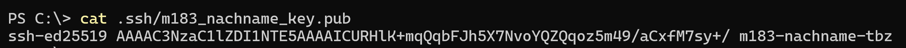
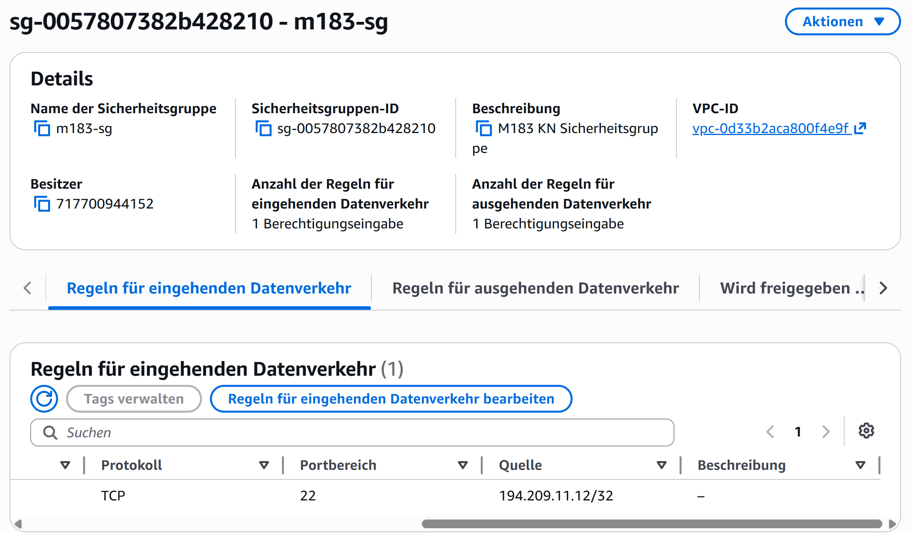
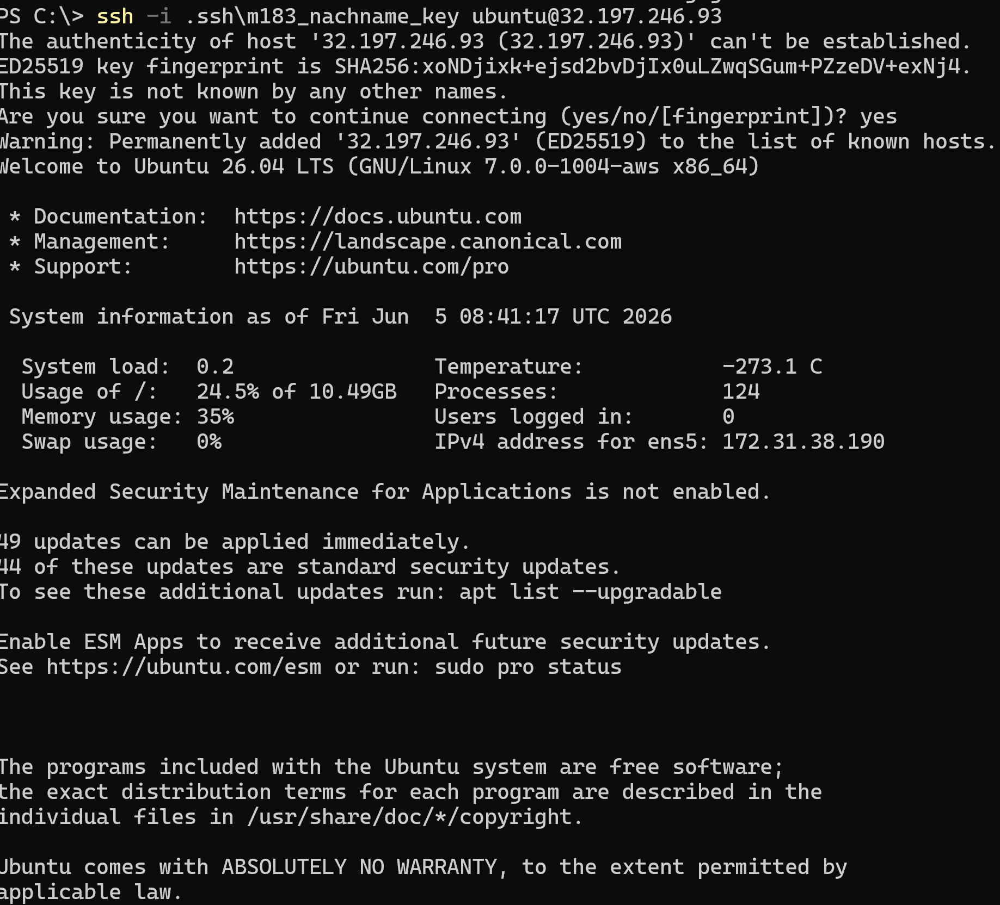
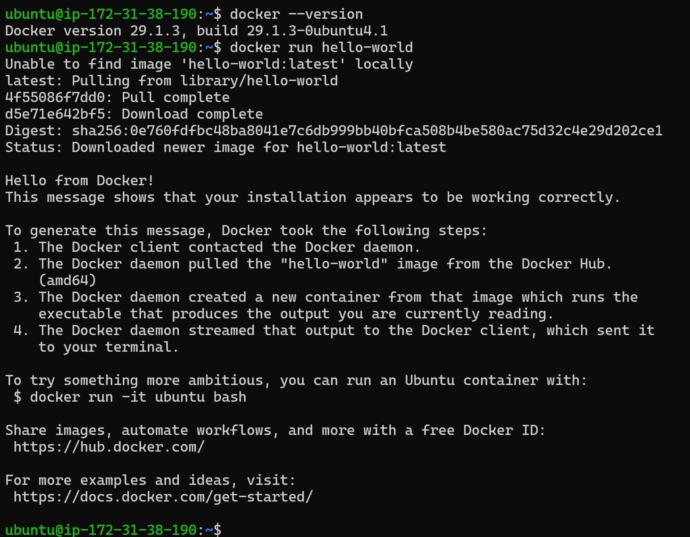

# KN0 – AWS EC2 Setup mit Docker

**Name:** [Wiederkehr]  
**Datum:** [05.06.2026]  
**Modul:** [M183]

---

## B) SSH-Schlüsselpaar lokal generieren

**Screenshot Terminal – Public Key Ausgabe:**

<!-- Screenshot einfügen: Terminalausgabe von `cat ~/.ssh/m183_nachname_key.pub` -->
<!-- Der vollständige Public Key muss sichtbar sein -->

---

## C) Sicherheitsgruppe erstellen

**Screenshot Sicherheitsgruppe m183-sg mit Inbound Rules:**

<!-- Screenshot einfügen: AWS Console → EC2 → Security Groups → m183-sg → Inbound Rules -->
<!-- Die konkrete IP-Adresse (nicht 0.0.0.0/0) muss sichtbar sein -->

---

## E) SSH-Verbindung herstellen und Docker prüfen

**Screenshot SSH-Terminal mit Docker-Ausgabe:**

<!-- Screenshot einfügen: SSH-Terminal mit Prompt ubuntu@ip-... -->
<!-- Muss enthalten: docker --version und docker run hello-world -->
<!-- Die Zeile "Hello from Docker!" muss sichtbar sein -->

---