# KN01 – OWASP Top 10 / Gruyere

**Name:** [Wiederkehr]  
**Datum:** [12.06.2026]  
**Modul:** [M183]

---

## A) Gruyere starten und Accounts erstellen

**UID:** `496241259538858813365967022696090127065`

> **Screenshot 1:** Gruyere-Startseite mit UID in der URL  
> 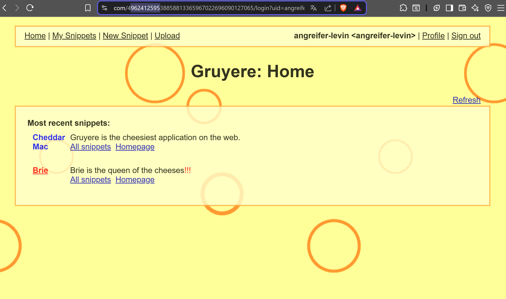

> **Screenshot 2:** Profilseite / Bestätigung beider Accounts  
> 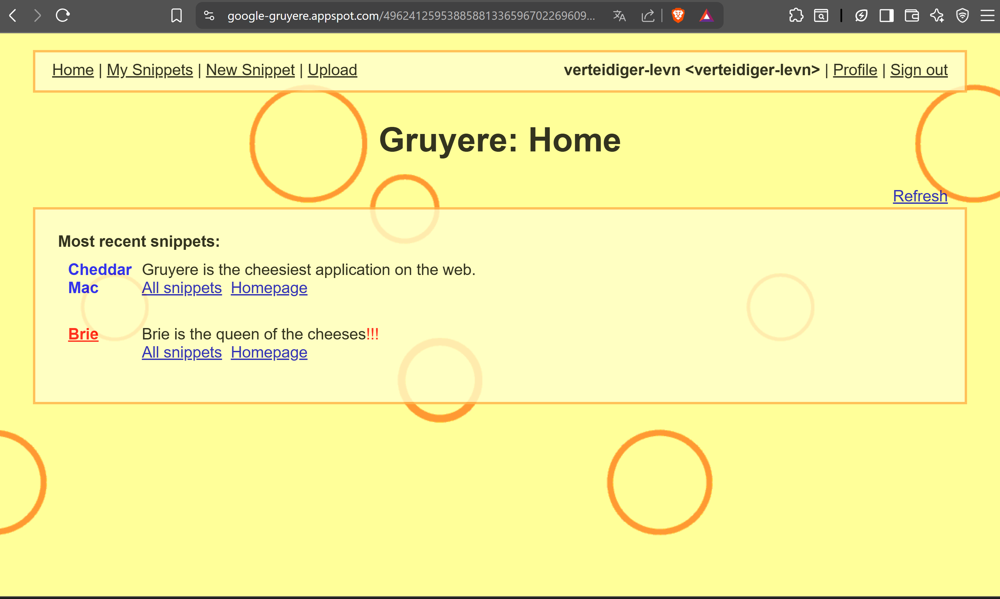

---

## B1 – DOM-Manipulation als Proof of Concept

> **Screenshot 3:** Menü mit rotem Hintergrund (Angreifer-Fenster)  
> 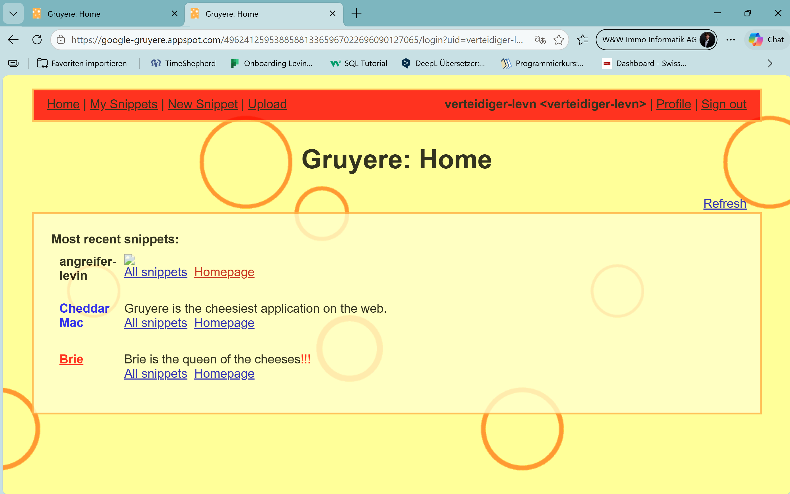

> **Screenshot 4:** Menü mit rotem Hintergrund (Verteidiger-Fenster)  
> 

### Schriftliche Antworten

**1. Warum konnte der Payload die Sicherheitsprüfung umgehen?**  
Browser blockieren `<script>`-Tags in bestimmten Kontexten, aber `` gilt als harmlos. Der `onerror`-Handler wird automatisch ausgeführt, wenn das Bild nicht lädt – das ist normales Browser-Verhalten. Event-Handler-Attribute wie `onerror`, `onload` oder `onclick` können ebenfalls JavaScript ausführen, werden aber oft nicht gefiltert.

**2. Was bedeutet die Ausführung im Browser des Verteidigers?**  
Der Payload ist in der Datenbank gespeichert und wird bei jedem Seitenaufruf ausgeführt – auch beim Verteidiger, ohne dass er etwas tun muss. Ein echter Angriff könnte so Session-Cookies stehlen, Tastatureingaben abfangen oder auf Phishing-Seiten umleiten. Stored XSS skaliert: ein Payload, alle Nutzer betroffen.

**3. OWASP Top 10 Kategorie**  
**A03 – Injection** (XSS gilt als Injection, da Nutzerdaten als Code interpretiert werden)

**4. Output Encoding**  
Die Applikation muss Sonderzeichen vor der Ausgabe HTML-enkodieren: `<` → `&lt;`, `>` → `&gt;` usw. Dann zeigt der Browser den Payload als harmlosen Text an, statt ihn als HTML/JavaScript auszuführen. Ergänzend hilft eine **Content Security Policy (CSP)**, die Inline-Skripte generell unterbindet.

---

## B2 – Cookies: Was sie sind und warum sie gefährlich sind

> **Screenshot 5:** DevTools mit sichtbarem Cookie-Wert  
> 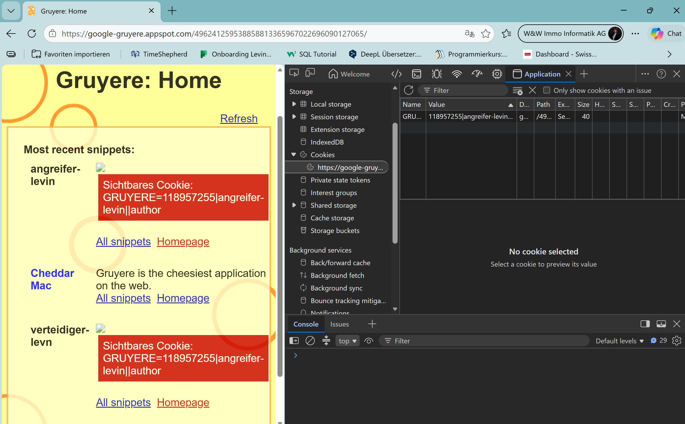

> **Screenshot 6:** Roter Kasten im Verteidiger-Fenster (Cookie des Verteidigers)  
> 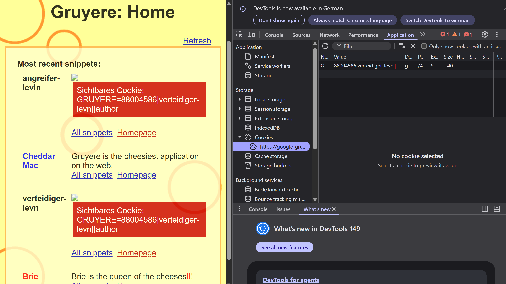

### Beobachtungen

**Wessen Cookie wird im roten Kasten angezeigt (Angreifer-Fenster)?**  
Der eigene Cookie des Angreifers – JavaScript läuft im Browser des jeweiligen Besuchers und liest dessen `document.cookie`.

**Welches Cookie erscheint im Verteidiger-Fenster?**  
Der Cookie des Verteidigers. Der Payload ist gespeichert und wird im Browser des Verteidigers ausgeführt – und liest dort dessen Cookie.

### Schriftliche Antworten

**1. Was kann ein Angreifer mit dem Session-Cookie tun?**  
Er kann die Session des Opfers vollständig übernehmen – ohne Passwort. Dazu kopiert er den Cookie-Wert in seinen eigenen Browser. Der Server sieht nur die gültige Session-ID und hält ihn für den eingeloggten Nutzer.

**2. Was bewirkt das `HttpOnly`-Flag?**  
Ein mit `HttpOnly` markierter Cookie ist für JavaScript nicht lesbar – `document.cookie` gibt ihn nicht zurück. Dieser Payload hätte also nichts angezeigt, da der Cookie gar nicht erst zugänglich wäre.

**3. Warum ist `localStorage` gefährlicher als ein `HttpOnly`-Cookie?**  
`localStorage` ist immer per JavaScript lesbar – es gibt kein Äquivalent zum `HttpOnly`-Flag. Jeder XSS-Payload kann direkt mit `localStorage.getItem(...)` den Token auslesen. Ein `HttpOnly`-Cookie bleibt selbst bei erfolgreichem XSS unsichtbar.

---

## B3 – Session-Hijacking: Cookie-Exfiltration

> **Hinweis:** Die Gruyere-Instanz war während dieser Aufgabe nicht erreichbar. Dies wurde dokumentiert und mit dem Lehrer besprochen. Die Webseite war weder im Schulnetz, noch mit einem Hotspot erreichbar. Ebenfalls konnte ich zusätzlich weder mit einer Sandbox, noch mit dem Handy auf die Seite zugreifen.

> **Screenshot 7:** SSH-Terminal 1 – Python-Server mit eingehender GET-Anfrage  
> 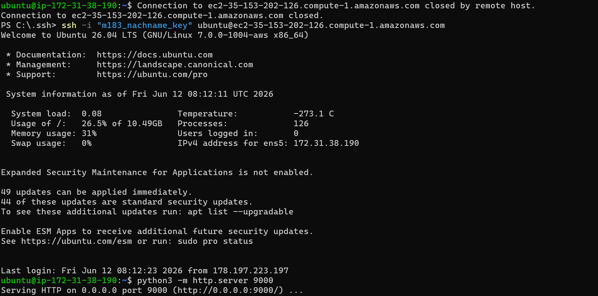

> **Screenshot 8:** SSH-Terminal 2 – Serveo HTTPS-URL  
> 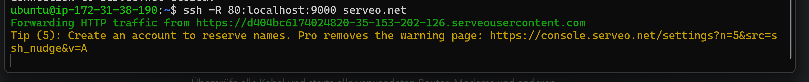

> **Screenshot 9:** Gruyere-Fenster des Angreifers nach Cookie-Übernahme  
> 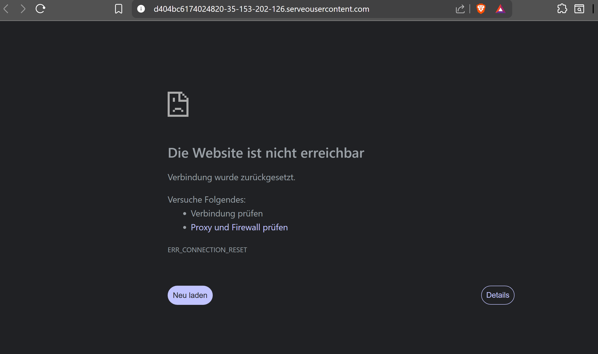

### Schriftliche Antworten

**1. Warum erhielt der Angreifer den Cookie ohne Passwort oder Browserzugriff?**  
Der Payload war als Stored XSS gespeichert. Als der Verteidiger die Seite aufrief, führte sein eigener Browser den Code aus und schickte den Cookie aktiv an den Angreifer-Server. Der Angreifer musste nichts weiter tun.

**2. Warum funktioniert `new Image().src` trotz Same-Origin-Policy?**  
Die Same-Origin-Policy blockiert das Lesen von Antworten fremder Origins – nicht das Senden von Anfragen. Das Laden eines Bildes ist eine einseitige GET-Anfrage, die Browser zu jeder Domain erlauben. Der Cookie-Wert steht bereits in der URL der Anfrage.

**3. Warum war der Serveo-Tunnel notwendig?**  
Gruyere läuft unter HTTPS. Browser blockieren Mixed Content: eine HTTPS-Seite darf keine HTTP-Anfragen senden. Eine direkte Anfrage an `http://<EC2-IP>:9000` wäre blockiert worden. Serveo stellt dem lokalen Server eine HTTPS-URL zur Verfügung.

**4. Zwei technische Massnahmen gegen diesen Angriff**  
- **`HttpOnly`-Flag:** `document.cookie` gibt den Cookie nicht zurück – der Payload kann ihn nicht auslesen.  
- **Content Security Policy (CSP):** Mit `connect-src` oder `img-src` hätte der Browser die Anfrage an `serveo.net` blockiert.

**5. Was bewirkt das `Secure`-Flag?**  
Ein Cookie mit `Secure`-Flag wird nur über HTTPS-Verbindungen gesendet. Es schützt vor Man-in-the-Middle-Angriffen in unverschlüsselten Netzwerken. Gegen XSS-basierte Exfiltration wie in B3 hilft es nicht, da der Cookie per JavaScript ausgelesen und über HTTPS verschickt wurde.

---

## C) Reflected XSS in Gruyere

> **Screenshot 10:** DevTools → Network → Response mit Payload im HTML  
> 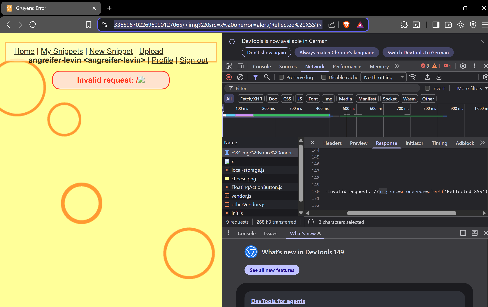

> **Screenshot 11:** Ausgeführter Alert mit Payload in der URL  
> `[Screenshot einfügen]`
> **Hinweis:** Der Alert wird aufgrund von Brave gesperrt und im Edge wurde er nicht angezeigt.

### Schriftliche Antworten

**1. Hauptunterschied Stored XSS vs. Reflected XSS**  
Stored XSS wird in der Datenbank gespeichert und trifft jeden Besucher – automatisch. Reflected XSS existiert nur in der URL und trifft nur Personen, die genau diesen Link öffnen. Stored XSS hat deutlich grössere Reichweite, Reflected XSS ist flüchtig und zielt auf einzelne Opfer.

**2. Social Engineering bei Reflected XSS**  
Der Angreifer verschickt den manipulierten Link so, dass er legitim wirkt: per Phishing-Mail, via URL-Shortener (z.B. bit.ly) um den Payload zu verstecken, oder als glaubwürdiger Link in einem Chat/Forum. Das Opfer muss nur klicken – der Payload läuft sofort beim Laden der Seite.

**3. OWASP Proactive Control gegen XSS**  
**C4 – Encode and Escape Data** – Alle Ausgaben müssen kontextgerecht enkodiert werden (HTML, JavaScript, URL, CSS), bevor sie im Browser landen. Damit wird verhindert, dass Nutzereingaben als Code interpretiert werden.

---

## D) Client-State Manipulation

> **Screenshot 12:** DevTools mit Cookie-Inhalt nach der Manipulation  
> 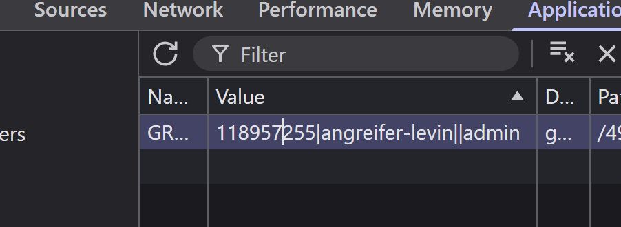

> **Screenshot 13:** Applikation nach Neuladen  
> 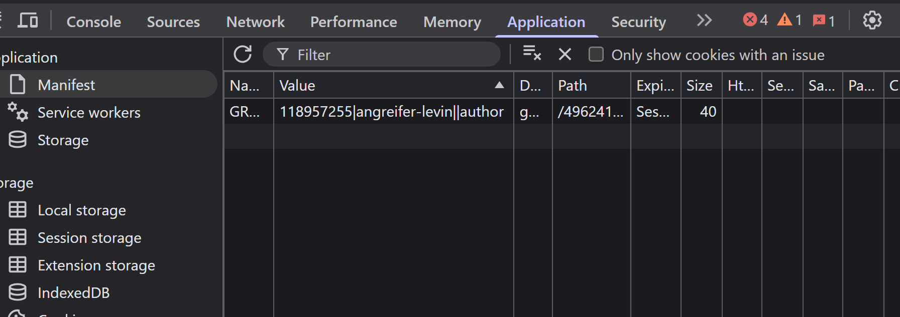

>**Hinweis:** Der Wert wird nach dem neuladen wieder von Admin zu Author geswitcht. Ebenfalls kann der Wert nicht mit einem curl verändert werden. Nach dem curl, wird man automatisch ausgeloggt. Dies sieht man daran, dass im Response im HTML nur noch die Menü-Punkte Sign In und Sign Up zur Verfügung stehen.

> curl -s \
> -H "Cookie: GRUYERE=118957255|angreifer-levin||admin" \
> "https://google-gruyere.appspot.com/496241259538858813365967022696090127065/"

> **Screenshot 14:** Response vom Curl
> 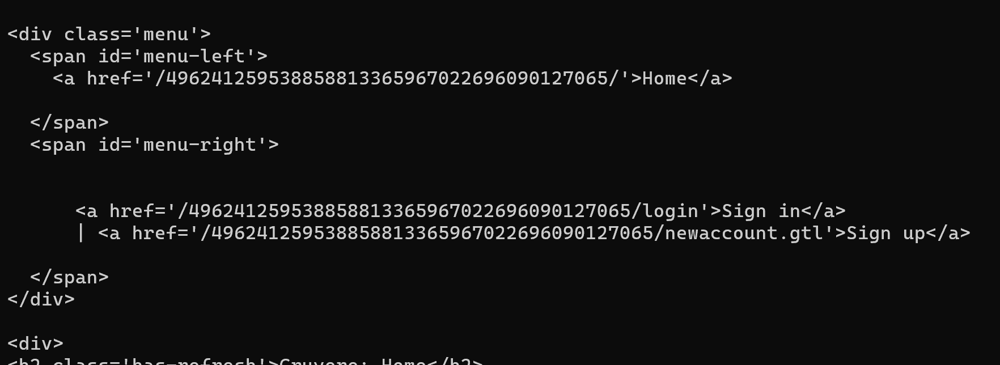

### Beobachtung zur Manipulation

Cookie-Wert im Klartext: `118957255|angreifer-levin||author`  
Format: `UserID|Username||Rolle`

Bei der Manipulation (`||author` → `||admin`) wurde die Session vom Server ungültig gemacht – der Benutzer wurde ausgeloggt. Dies zeigt, dass Gruyere den Cookie in diesem Fall serverseitig validiert. Ein direkter `curl`-Request mit manipuliertem Cookie ergab ebenfalls keine erhöhten Rechte.

### Schriftliche Antworten

**1. Warum ist es gefährlich, Rollen im Client zu speichern?**  
Der Client (Browser) liegt vollständig unter der Kontrolle des Benutzers. Jeder kann Cookie-Werte oder localStorage-Einträge beliebig verändern – mit DevTools in Sekunden. Sicherheitsrelevante Daten im Client zu speichern bedeutet, dem Angreifer die Kontrolle zu überlassen.

**2. Wo sollten Berechtigungsprüfungen stattfinden?**  
Ausschliesslich auf dem **Server**. Der Server ist die einzige vertrauenswürdige Instanz – er liegt ausserhalb der Kontrolle des Angreifers. Clientseitige Prüfungen können immer umgangen werden und dienen höchstens der UX, nie der Sicherheit.

**3. OWASP Top 10 Kategorie**  
**A01 – Broken Access Control** – Fehlende oder unzureichende serverseitige Berechtigungsprüfung erlaubt es Angreifern, auf Funktionen oder Daten zuzugreifen, für die sie keine Berechtigung haben.