##  KN02 – SQL Injection

## A – WebGoat starten

> **Screenshot 1:** Sicherheitsgruppe anpassen 
> 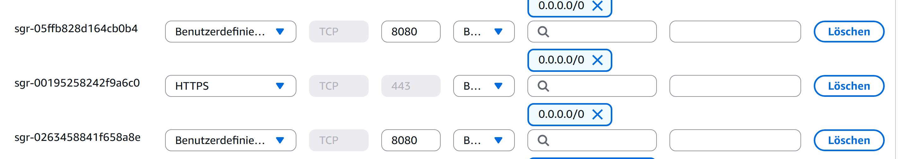

>**Hinweis:** Ich habe hier 0.0.0.0/0 auch noch hinzugefügt, da es bei der letzten Aufgabe notwendig war, da ich auf den Hotspot switchen musste. Falls das hier auch wieder der Fall sein wird, habe ich es sicherheitshalber auch hinzugefügt.

> **Screenshot 2:** Registrieren des Accounts bestätigen  
> 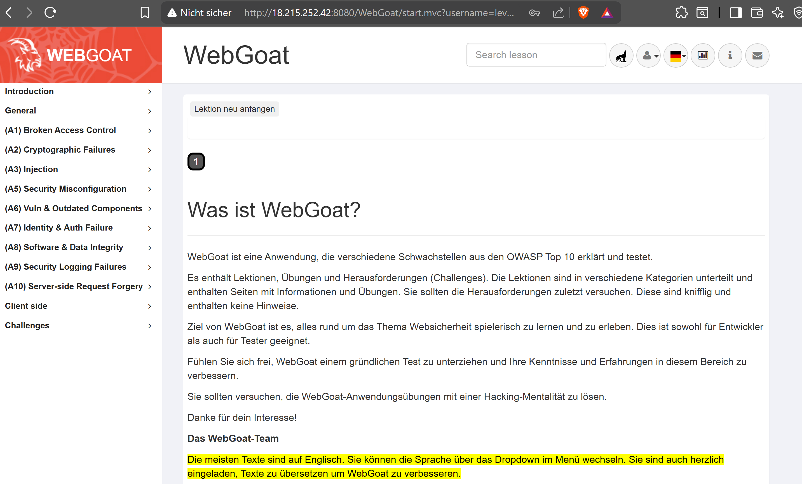

## B1 – Login Bypass

> **Screenshot 2:** Gelöste B1-Aufgabe  
> 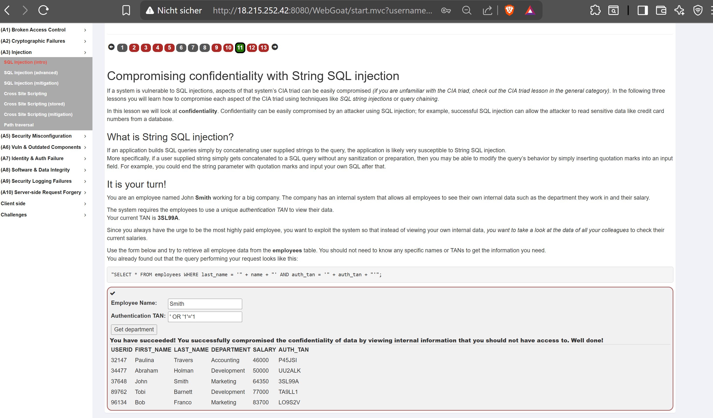

## B2 – Query Chaining: Integrität kompromittieren

> **Screenshot 1:** Gelöste B2-Aufgabe 
> 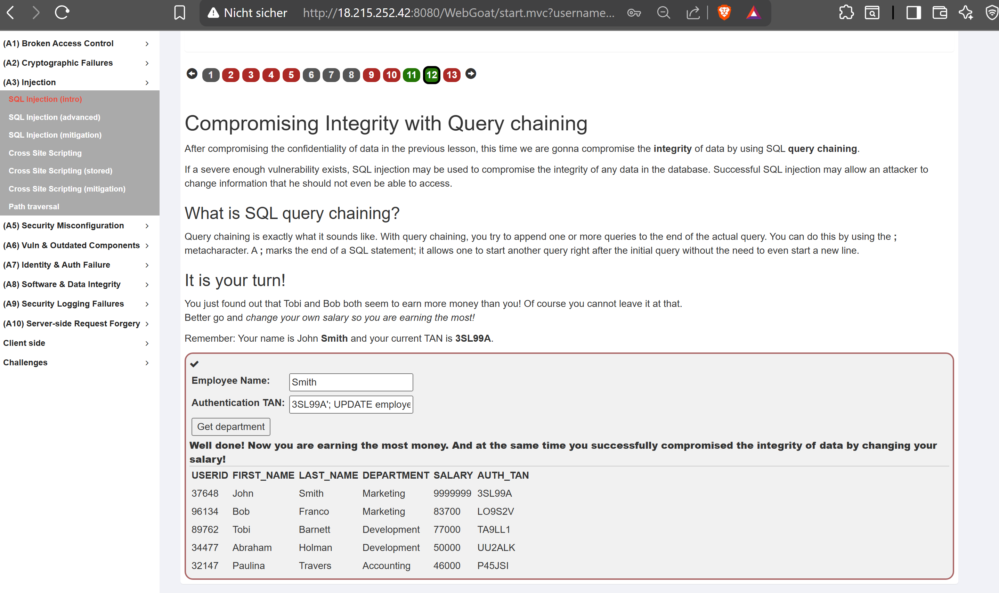

### Frage 1: SQL-Statement vor und nach dem Payload (B1 – Login Bypass)

**Vor dem Einschleusen:**
```sql
SELECT * FROM users WHERE name = 'Smith' AND password = 'geheim'
```

**Nach dem Einschleusen** (Payload im Passwort-Feld: `' OR '1'='1`):
```sql
SELECT * FROM users WHERE name = 'Smith' AND password = '' OR '1'='1'
```

**Erklärung:**  
Durch den Payload wird die ursprüngliche Passwort-Bedingung mit einem `OR` erweitert.
Da `'1'='1'` immer wahr ist, gibt die gesamte WHERE-Bedingung immer `TRUE` zurück –
unabhängig davon, ob Name oder Passwort korrekt sind. Die Datenbank liefert alle
passenden Zeilen zurück, und die Applikation interpretiert dies als erfolgreichen Login.
Die Authentifizierung wird also nicht geknackt, sondern vollständig umgangen.

---

### Frage 2: Wie funktionieren Prepared Statements?

Bei einem **Prepared Statement** (parametrisierte Abfrage) wird die SQL-Abfrage zuerst
ohne Benutzereingaben kompiliert und an die Datenbank gesendet. Die Struktur der Abfrage
ist damit fix. Erst danach werden die Benutzereingaben als reine **Datenwerte** übergeben –
niemals als Teil des SQL-Codes.

**Beispiel in Java:**
```java
// Unsicher (anfällig für SQLi):
String query = "SELECT * FROM users WHERE name = '" + userInput + "'";

// Sicher (Prepared Statement):
PreparedStatement stmt = conn.prepareStatement(
    "SELECT * FROM users WHERE name = ?");
stmt.setString(1, userInput);
```

Der Platzhalter `?` wird von der Datenbank intern behandelt. Gibt ein Angreifer
`Smith' OR '1'='1` ein, wird dieser String **wörtlich** als Name gesucht – er wird
nicht als SQL-Code interpretiert. SQL Injection ist damit strukturell unmöglich,
weil Code und Daten strikt getrennt bleiben.

---

### Frage 3: OWASP Top 10 (2025) – Kategorie für SQL Injection

**A03 – Injection**

SQL Injection fällt unter die Kategorie **A03:2021 – Injection** (in der aktuellen
OWASP Top 10 weiterhin als A03 geführt). Sie beschreibt alle Angriffe, bei denen
nicht vertrauenswürdige Daten als Befehle oder Abfragen an einen Interpreter
weitergeleitet werden.

---

### Frage 4: Zwei weitere Injection-Varianten

**1. OS Command Injection**  
Dabei wird Betriebssystem-Code in eine Eingabe eingeschleust, die von der Applikation
an die Shell weitergegeben wird. Beispiel: Eine Applikation führt `ping <eingabe>` aus –
gibt der Angreifer `8.8.8.8; rm -rf /` ein, wird nach dem Ping-Befehl ein gefährlicher
Shell-Befehl ausgeführt. Die Gefahr liegt darin, dass der Angreifer damit vollständige
Kontrolle über das Betriebssystem erlangen kann (Dateilöschen, Backdoors, etc.).

**2. LDAP Injection**  
LDAP (Lightweight Directory Access Protocol) wird häufig für Authentifizierung und
Benutzerverzeichnisse eingesetzt (z.B. Active Directory). Werden Benutzereingaben
ungefiltert in LDAP-Suchanfragen eingebaut, kann ein Angreifer die Filter-Logik
manipulieren. Beispiel: Ein Payload wie `*)(uid=*))(|(uid=*` kann dazu führen,
dass alle Benutzer im Verzeichnis zurückgegeben werden. Die Gefahr liegt im
unautorisierten Zugriff auf Verzeichnisdaten oder der Umgehung der Authentifizierung.


## C1a

> **Screenshot 1:** Gelöste C1a-Aufgabe (Alert)
> 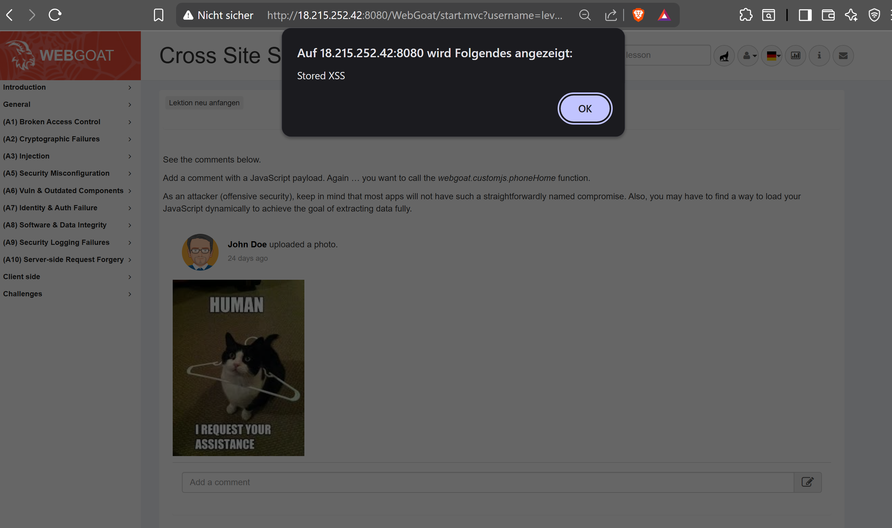

> **Screenshot 1:** Gelöste C1a-Aufgabe 
> 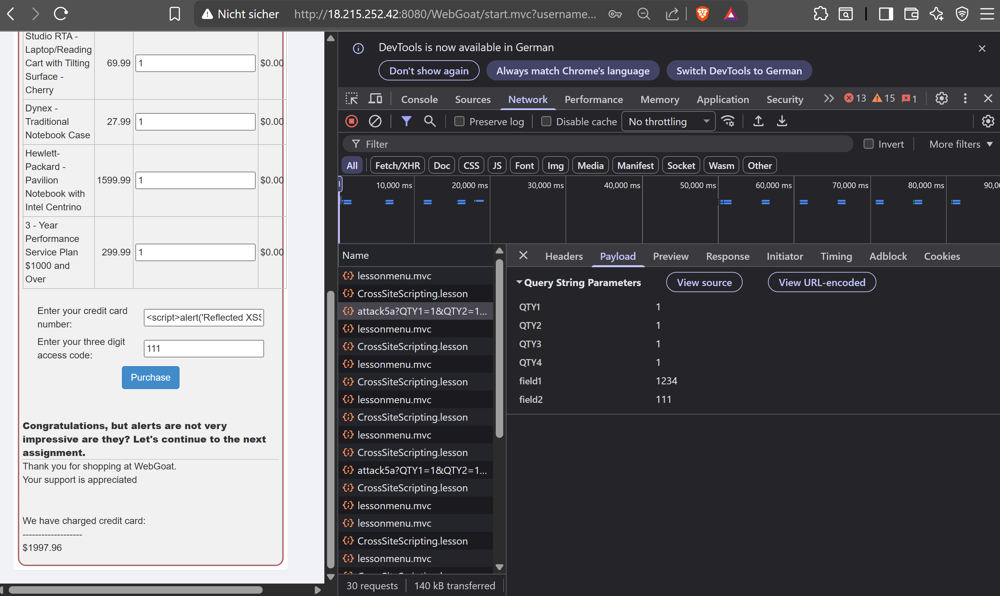

## C1b

> **Screenshot 1:** Gelöste C1b-Aufgabe 
> 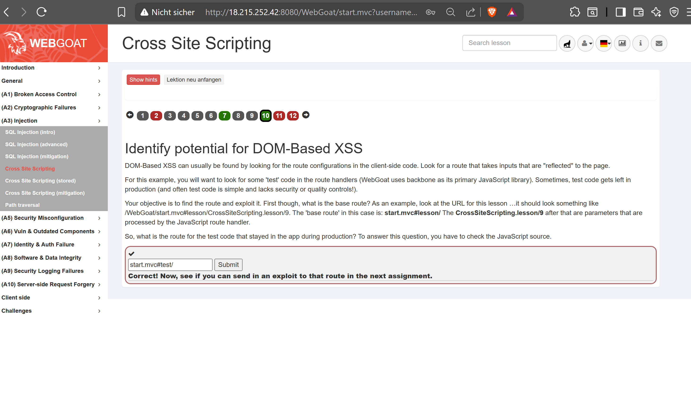

## C2

> **Screenshot 1:** Gelöste C2-Aufgabe 
> 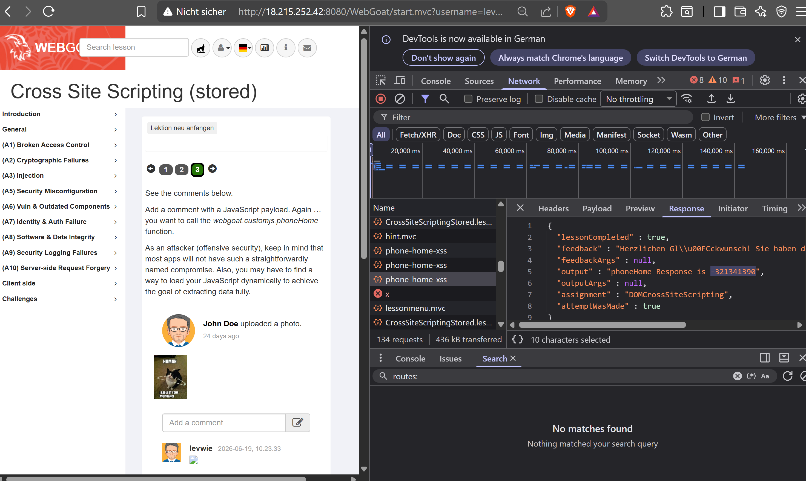

### Frage 1: Reflected XSS vs. Stored XSS

**Reflected XSS** ist nicht persistent. Der Payload befindet sich in der URL oder
einer Formulareingabe und wird vom Server direkt in die Antwort eingebettet –
er wird einmal ausgeführt und nicht gespeichert. Das Opfer muss aktiv einen
präparierten Link anklicken. Die Reichweite ist dadurch begrenzt und gezielt.

**Stored XSS** ist persistent. Der Payload wird dauerhaft in der Datenbank
gespeichert (z.B. als Kommentar oder Profilfeld) und bei jedem Seitenaufruf
erneut ausgeführt – für alle Benutzer, die die Seite besuchen, ohne dass sie
etwas anklicken müssen. Die Reichweite ist damit deutlich grösser und
gefährlicher.

---

### Frage 2: DOM-based XSS vs. Reflected XSS

Bei **Reflected XSS** verarbeitet der Server die Eingabe und gibt sie in der
HTTP-Antwort zurück. Ein serverseitiger Filter kann den Payload also abfangen,
bevor er den Browser erreicht.

Bei **DOM-based XSS** läuft der Angriff vollständig im Browser ab. Der Server
sendet eine normale, saubere HTML-Seite – der schadhafter Code wird erst durch
clientseitiges JavaScript (z.B. via `document.location` oder `innerHTML`)
in den DOM geschrieben und ausgeführt. Der Server sieht den Payload nie,
weshalb serverseitige Filter wirkungslos sind. Nur clientseitige Massnahmen
(z.B. sichere DOM-APIs, CSP) können schützen.

---

### Frage 3: Output Encoding

Output Encoding bedeutet, dass alle Benutzereingaben vor der Ausgabe im HTML
in ihre harmlose, kodierte Form umgewandelt werden. Sonderzeichen wie `<`, `>`
oder `"` werden als HTML-Entities dargestellt – der Browser rendert sie dann
als Text, nicht als Code.

**Beispiel:**

| Original      | Nach Encoding   |
|---------------|-----------------|
| `<script>`    | `&lt;script&gt;` |
| `>`           | `&gt;`          |
| `"`           | `&quot;`        |

Der Payload `<script>alert('XSS')</script>` wird im Browser als sichtbarer
Text angezeigt, aber niemals als JavaScript ausgeführt – XSS ist damit
verhindert.

---

### Frage 4: Content-Security-Policy (CSP)

Der HTTP-Header `Content-Security-Policy` teilt dem Browser mit, welche
Quellen für Scripts, Styles und andere Ressourcen erlaubt sind. Der Browser
blockiert alles, was nicht explizit erlaubt wurde.

**Beispiel:**

Content-Security-Policy: default-src 'self'; script-src 'self'

Damit darf der Browser nur Scripts laden, die vom eigenen Server stammen.
Ein eingeschleuster Inline-Script wie `<script>alert('XSS')</script>` wird
vom Browser blockiert, weil Inline-Scripts ohne `'unsafe-inline'` standardmässig
verboten sind. CSP ist eine wichtige zweite Verteidigungslinie – selbst wenn
Output Encoding vergessen wurde, verhindert CSP die Ausführung des Payloads.

---

### Frage 5: OWASP Top 10 (2021) – Kategorie für XSS

**A03:2021 – Injection**

XSS wird in der OWASP Top 10 2021 unter **A03 – Injection** eingeordnet,
da es sich um das Einschleusen von nicht vertrauenswürdigem Code handelt,
der vom Browser als gültiges Script interpretiert wird. (In früheren
Versionen hatte XSS eine eigene Kategorie – A7:2017.)


## D

> **Screenshot 1:** HTML-Code
> 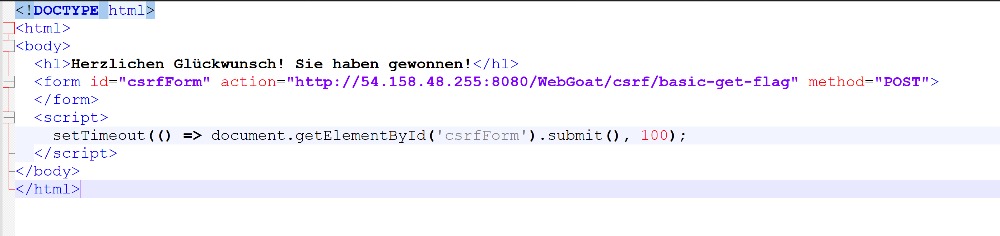

> **Screenshot 1:** Erfolgreicher Angriff
> 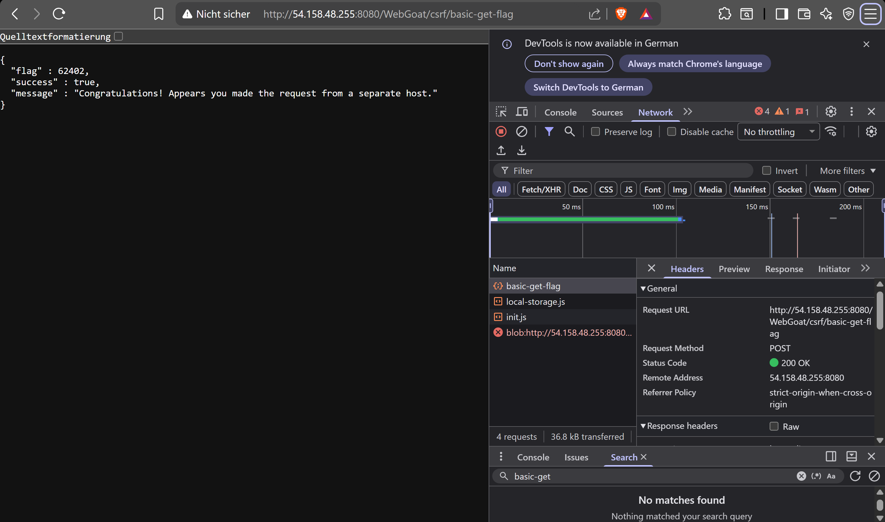

### Frage 1: Warum schickt der Browser den Session-Cookie mit?

Der Browser speichert Cookies domain-gebunden. Wenn das Opfer in WebGoat
eingeloggt ist, liegt ein Session-Cookie für die Domain
`54.158.48.255:8080` im Browser. Sobald eine Anfrage – egal von welcher
Seite – an diese Domain geht, hängt der Browser den Cookie automatisch
an. Das ist grundlegendes HTTP-Verhalten.

Das Opfer muss die Angreifer-Seite nicht "bewusst" besuchen – es reicht,
dass der Browser die Seite lädt und das Formular automatisch submitted.
Der Browser fragt nicht, ob die Anfrage vom Opfer gewollt ist. Er sieht
nur: "Anfrage an diese Domain → Cookie mitschicken".

---

### Frage 2: Was ist ein CSRF-Token und warum kann der Angreifer ihn nicht lesen?

Ein CSRF-Token ist ein zufälliger, geheimer Wert, den der Server beim
Laden eines Formulars generiert und in einem versteckten Formularfeld
(`<input type="hidden">`) einfügt. Bei jeder Anfrage schickt der Client
diesen Token mit – der Server prüft ob er gültig ist.

Der Angreifer kann den Token nicht lesen, weil die
**Same-Origin-Policy (SOP)** des Browsers das verhindert. Eine Seite
von `localhost:9090` darf den HTML-Inhalt von `54.158.48.255:8080`
nicht lesen – also kann sie das versteckte Token-Feld nicht auslesen.
Ohne den korrekten Token lehnt der Server die Anfrage ab.

In WebGoat war der Token hardcoded (`2aa14227b9a13d0bede0388a7fba9aa9`)
und nicht session-spezifisch – deshalb funktionierte der Angriff trotzdem.
Das ist genau die Schwachstelle, die die Aufgabe demonstriert.

---

### Frage 3: Was bewirkt `SameSite=Strict`?

Das `SameSite`-Flag steuert, wann der Browser einen Cookie bei
Cross-Site-Anfragen mitschickt.

| Wert | Verhalten |
|------|-----------|
| `Strict` | Cookie wird **nie** bei Cross-Site-Anfragen mitgeschickt |
| `Lax` | Cookie wird nur bei Top-Level-Navigation (z.B. Link-Klick) mitgeschickt |
| `None` | Cookie wird immer mitgeschickt (erfordert `Secure`) |

Mit `SameSite=Strict` schickt der Browser den Session-Cookie **nur**
mit, wenn die Anfrage von derselben Domain kommt wie die, die den Cookie
gesetzt hat. Eine Anfrage von `localhost:9090` an `54.158.48.255:8080`
würde den Cookie nicht mitsenden – der CSRF-Angriff schlägt fehl, weil
der Server keine Session-Informationen erhält und die Anfrage als
nicht authentifiziert behandelt.

---

### Frage 4: OWASP Top 10 (2021) – Kategorie für CSRF

**A01:2021 – Broken Access Control**

CSRF fällt unter **A01 – Broken Access Control**, da ein Angreifer im
Namen eines authentifizierten Benutzers unerlaubte Aktionen ausführt,
ohne die nötigen Berechtigungen selbst zu besitzen. Die Applikation
kann nicht unterscheiden, ob eine Anfrage vom echten Benutzer oder von
einer fremden Seite ausgelöst wurde – eine Verletzung der
Zugriffskontrolle.

> Hinweis: In der OWASP Top 10 2017 hatte CSRF noch eine eigene
> Kategorie (A8). In der Version 2021 wurde es in A01 integriert,
> da moderne Schutzmassnahmen (SameSite, CSRF-Tokens) die Häufigkeit
> stark reduziert haben.

## E

> **Screenshot 1:** Profil anschauen
> 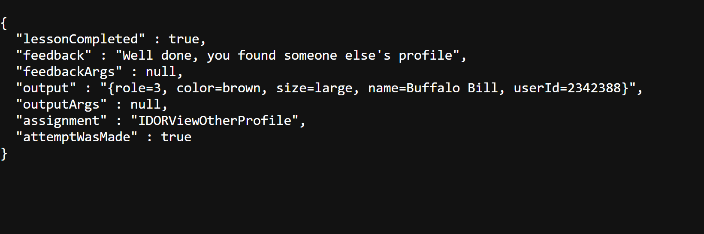

> **Screenshot 1:** Profil anpassen
> 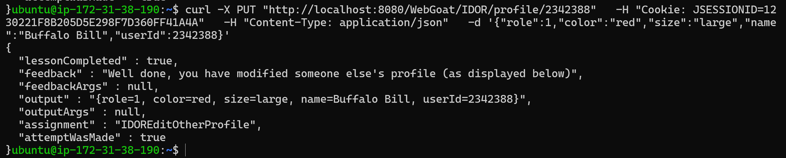

### Frage 1: Warum schützt «nicht verlinken» nicht? (Security through Obscurity)

«Security through Obscurity» bedeutet, sich auf die Unbekanntheit einer
Ressource zu verlassen, anstatt sie technisch abzusichern. Das ist kein
echter Schutz, weil:

- Ein Angreifer muss eine URL nicht kennen – er kann IDs systematisch
  durchprobieren (z.B. id=1, id=2, id=3 ...).
- Browser-Verlauf, Server-Logs, Referrer-Header oder andere Nutzer
  können URLs leaken.
- Tools wie Burp Suite oder curl machen automatisiertes Enumeration
  trivial einfach.

Eine Ressource, die nicht verlinkt ist, aber keine Zugriffsprüfung hat,
ist genauso unsicher wie eine verlinkte. Sicherheit muss serverseitig
erzwungen werden – nicht durch Verstecken.

---

### Frage 2: Wie hätte die Applikation IDOR verhindern können?

Die notwendige serverseitige Prüfung sieht so aus:

1. **Authentifizierung:** Ist der Benutzer überhaupt eingeloggt?
2. **Autorisierung:** Gehört die angefragte Ressource diesem Benutzer?

Konkret beim Profilzugriff:

// Pseudocode

requestedId = request.getParam("id")

loggedInUserId = session.getUserId()
if (requestedId != loggedInUserId) {

return HTTP 403 Forbidden

}

Alternativ: Statt numerische IDs zu verwenden, kann die Applikation
die ID direkt aus der Session lesen – der Benutzer gibt gar keine ID
an, der Server weiss selbst, welches Profil gemeint ist. Zusätzlich
helfen UUIDs statt sequentieller IDs, da sie schwerer zu erraten sind
(aber kein Ersatz für echte Zugriffsprüfung).

---

### Frage 3: Horizontale vs. vertikale Privilegienerweiterung

| Typ | Beschreibung |
|-----|-------------|
| **Horizontal** | Zugriff auf Ressourcen eines anderen Benutzers **gleicher** Berechtigungsstufe |
| **Vertikal** | Zugriff auf Funktionen einer **höheren** Berechtigungsstufe (z.B. Admin) |

**Dieses IDOR-Beispiel zeigt horizontale Privilegienerweiterung.**

Der Angreifer ist ein normaler eingeloggter Benutzer und greift auf
das Profil eines anderen normalen Benutzers zu. Er erlangt keine
Admin-Rechte – er überschreitet aber die Grenzen seiner eigenen
Datenzugriffe. Das ist die häufigste Form von IDOR.

---

### Frage 4: OWASP Top 10 (2021) – Broken Access Control

**A01:2021 – Broken Access Control**

Broken Access Control steht erstmals auf Platz 1, weil es in
**94% aller getesteten Applikationen** in irgendeiner Form vorkommt.
Die Kategorie umfasst alle Fälle, in denen eine Applikation nicht
korrekt prüft, ob ein Benutzer auf eine Ressource oder Funktion
zugreifen darf.

Gründe für Platz 1:

- Zugriffsprüfungen werden häufig vergessen oder inkonsistent
  implementiert (z.B. nur im Frontend, nicht im Backend).
- IDOR ist trivial auszunutzen – kein Spezialwissen nötig.
- Moderne APIs und SPAs exponieren oft direkt IDs in URLs oder
  JSON-Responses, was Enumeration erleichtert.
- Automatisierte Security-Scanner erkennen fehlende
  Autorisierungsprüfungen schlecht, da sie den Kontext nicht kennen.

## F

> **Hinweis:** Der Token wurde erfolgreich manipuliert:
>
> **Screenshot 1:** Manipulierter Token
> 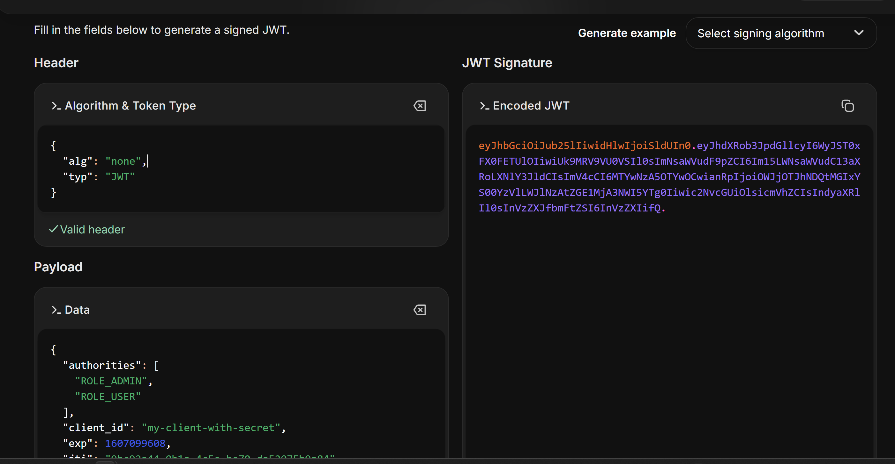
>
> Wenn der Token eingesetzt wurde und eine Aktion ausgeführt wird, verändert sich nichts. Wenn ich die Seite neulade, verschwindet die Aufgabe und der Token ebenfalls. Ich habe es jeweils im Brave- und auch im Edge-Browser getestet und in beiden Fällen passiert das Gleiche. Ebenfalls konnte mir der Lehrer leider nicht weiterhelfen.
>
> **Screenshot 1:** Leerer Token
> 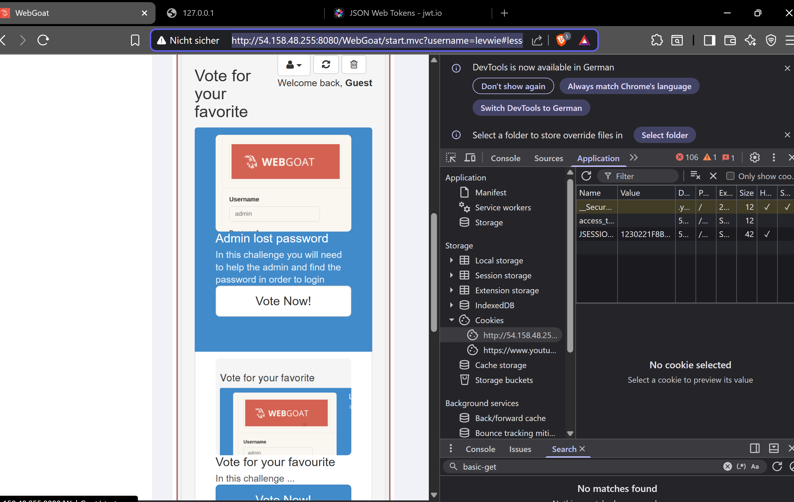